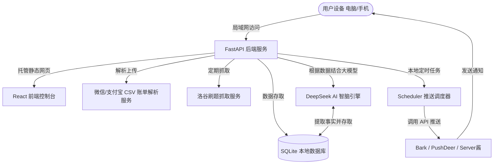

# MOSS-Lite (赛博自律飞船控制舱) 设计规范

本文档定义了 **MOSS-Lite** 系统的架构设计、数据表模型、前端交互组件及 AI 智脑和提醒推送机制。

## 1. 项目概述 & 目标

MOSS-Lite 是一个本地运行的、面向手机与电脑局域网通用的**赛博朋克风自律数据控制舱**。它通过高科技感的虚拟智脑核心（MOSS-Lite Core）进行交互，能够根据用户所处的不同生命周期或时期（例如备考、竞赛、度假）自适应调整分析逻辑和提醒策略。

### 核心特性：
* **太空舱赛博视觉**：深色暗黑控制台，全息 SVG 智脑波形球体，高对比度荧光霓虹色系（Cyan / Pink / Purple），极具科幻感。
* **自适应模式系统**：支持内置模式（备考、算法冲刺、日常、星际休假、深度阅读）与用户自定义生命模式。
* **数据三合一记录**：专注计时器与补登、收支记账（支持微信/支付宝账单 CSV 导入解析）、洛谷自动抓取与手动备份。
* **主动分析与自定义推送**：本地定时触发健康与专注警报，调用 Bark/PushDeer 推送到手机。
* **带有记忆的智脑**：基于本地 SQLite 的长期事实提取，对接 DeepSeek 等廉价 API 提供知晓主人心事与梦想的陪伴式闲聊。

---

## 2. 系统架构与数据流

系统采用前后端融合部署结构：
* **前端**：React (Vite) + Tailwind CSS + Lucide Icons + Recharts。使用 Canvas / SVG 开发全息粒子核心波形。
* **后端**：Python (FastAPI) + Uvicorn + SQLAlchemy。
* **数据库**：SQLite (`moss_lite.db`)。
* **部署运行**：前端编译打包为静态资源放入后端 `static/` 目录，通过主入口 `run.py` 或 `start.bat` 一键拉起，局域网共享 IP 访问。



---

## 3. 数据库设计 (SQLite Table Schemas)

使用五张核心数据表来记录所有数据：

### 3.1 `life_modes` (生命模式表)
用于存储系统内置及用户自定义的生活模式：
```sql
CREATE TABLE life_modes (
    id INTEGER PRIMARY KEY AUTOINCREMENT,
    name VARCHAR(50) UNIQUE NOT NULL,      -- 模式名称 (例如: finals, sprint, reading)
    display_name VARCHAR(100) NOT NULL,    -- 页面显示名称 (例如: 期末备考模式)
    description TEXT,                      -- 模式描述
    target_study_minutes INTEGER DEFAULT 0, -- 每日目标学习时间 (分钟)
    target_exercise_minutes INTEGER DEFAULT 0, -- 每日目标运动时间 (分钟)
    target_luogu_solved INTEGER DEFAULT 0, -- 每日目标刷题数
    allow_reminders BOOLEAN DEFAULT TRUE,  -- 是否允许在此模式下发送催促提醒
    ai_system_prompt TEXT                  -- 智脑在此模式下的对话语气指导
);
```

### 3.2 `study_records` (学习记录表)
记录专注时长及起止时间：
```sql
CREATE TABLE study_records (
    id INTEGER PRIMARY KEY AUTOINCREMENT,
    start_time TIMESTAMP,                  -- 开始时间
    end_time TIMESTAMP,                    -- 结束时间 (若为补登则直接指定起止)
    duration_minutes INTEGER NOT NULL,     -- 最终分钟数
    category VARCHAR(50) DEFAULT 'study',   -- 分类 (如: study, reading, coding)
    description TEXT,                      -- 备注
    date DATE DEFAULT CURRENT_DATE         -- 记录日期
);
```

### 3.3 `financial_records` (收支账单表)
记录所有的花费与收入明细：
```sql
CREATE TABLE financial_records (
    id INTEGER PRIMARY KEY AUTOINCREMENT,
    type VARCHAR(10) NOT NULL,             -- 'expense' (支出) 或 'income' (收入)
    amount DECIMAL(10, 2) NOT NULL,        -- 金额
    category VARCHAR(50) NOT NULL,         -- 账单分类 (如: 餐饮, 交通, 娱乐, 学习资料, 兼职)
    source VARCHAR(50) DEFAULT 'manual',   -- 数据来源: manual (手动) 或 csv_alipay/csv_wechat (导入)
    description TEXT,                      -- 消费说明
    created_at TIMESTAMP DEFAULT CURRENT_TIMESTAMP,
    date DATE DEFAULT CURRENT_DATE
);
```

### 3.4 `daily_metrics` (每日综合指数表)
记录每日的基础健康、算法数据 and 回顾评级：
```sql
CREATE TABLE daily_metrics (
    date DATE PRIMARY KEY,                 -- 日期
    weight DECIMAL(5, 2),                  -- 当天体重 (kg)
    height DECIMAL(5, 2),                  -- 记录时身高 (cm，用于算BMI)
    bmi DECIMAL(4, 2),                     -- BMI
    luogu_solved_count INTEGER DEFAULT 0,   -- 当天洛谷过题数
    overall_rating VARCHAR(5) DEFAULT 'B', -- 本地规则自动评级 (A, B, C, D)
    user_mood VARCHAR(20),                 -- 用户心情 (happy, tired, anxious, relaxed)
    ai_diary_review TEXT                   -- 智脑对这一天的综合点评日记
);
```

### 3.5 `brain_memories` (智脑长期记忆表)
用于保存从用户聊天中提取出来的“心事、目标、梦想”等记忆实体：
```sql
CREATE TABLE brain_memories (
    id INTEGER PRIMARY KEY AUTOINCREMENT,
    key_concept VARCHAR(100) NOT NULL,     -- 记忆概念 (例如: "高数期末考", "得金牌")
    content TEXT NOT NULL,                 -- 记忆具体内容
    importance_score INTEGER DEFAULT 3,    -- 重要程度 (1-5)
    created_at TIMESTAMP DEFAULT CURRENT_TIMESTAMP,
    updated_at TIMESTAMP DEFAULT CURRENT_TIMESTAMP,
    last_referenced_at TIMESTAMP
);
```

---

## 4. 前端交互设计 (React Components)

### 4.1 全息智脑核心 (HologramCore)
* **动态展现**：使用 HTML5 Canvas 或 SVG 渲染一个不断旋转的 3D 几何光栅球或波浪神经元。
* **状态渲染**：
  * **日常自律 (绿色/青色波形)**：平缓的中速旋转。
  * **专注计时中 (荧光蓝色粒子流向圆心)**：旋转加速，呈现数据吞噬动效。
  * **休假/放松 (幽蓝色慢波形)**：极慢呼吸状态。
  * **超支警告/自律危机 (红色电脉冲闪烁)**：高频不规则跳动。
* **文字交互**：核心上方或内部打字机特效显示状态（如 `MOSS-Lite Status: ACTIVE`）。

### 4.2 维度切换热力图 (DimensionHeatmap)
* 顶层提供快捷切换标签（🔥综合自律、💻洛谷刷题、📖日常学习、🏃体育运动）。
* 热力图单元格使用赛博朋克色阶渐变（无活动：深空灰 `#1A1C23` -> 满载活跃：荧光绿/青 `#66FCF1`）。
* 点击格子触发 Modal 弹窗，使用终端表格列出该天的全部流水（专注时间段、详细收支账单、体重、洛谷爬虫日志）。

### 4.3 记账本与 CSV 上传 (LedgerPanel)
* 提供快速收支表单（手动快速录入金额、类型、分类、备注）。
* **CSV 导入区**：支持拖拽支付宝 `alipay_record.csv` 或微信支付 `wechat_record.csv` 进行解析。后台将根据商户映射字典进行自动归类，并展示分类确认表格，用户微调后一键存入数据库。

### 4.4 专注计时器与补登 (FocusTimer)
* 具备“开始专注/暂停/结束”的仪表盘式计时钟。
* 专注时，网页进入**沉浸模式**（降低周围背景亮度，仅高亮 MOSS 核心与计时器，智脑核心呈现稳定频率脉冲）。
* 提供“历史补登”面板，允许选择日期、时间段（如 `15:00 - 16:30`）和任务类别补记时间。

---

## 5. 后端与 AI / 提醒推送机制

### 5.1 洛谷爬虫服务 (Luogu Scraper)
* 使用 `requests` 加上用户代理去请求 `https://www.luogu.com.cn/user/[UID]`。
* 解析页面中的打卡天数、通过题目数，存储每日差异增量，支持在页面一键“手动刷新数据”。

### 5.2 微信/手机推送 (Notification Service)
* 后端设置定时任务（基于 `apscheduler`）。
* 用户可在设置页面**自定义提醒规则**：
  * **触发时间**：可自定义（例如：晚上 21:00，早上 8:30）。
  * **触发规则**：自定义指标判定（如：今日学习时间 < 60分钟，或今日未记账，或 BMI 连续超标）。
  * **推送通道**：Bark（iOS 客户端，秒级推送）、PushDeer（微信扫码关注推送）或 Server酱。
  * **推送文案**：支持自定义固定模板，或者选择 **[AI 自动生成]**（结合主人今日数据和心事动态生成，如：*“MOSS-Lite 提示：检测到您的算法今日未进行洛谷数据提交，请及时调整状态进入代码舱进行操作。”*）。

### 5.3 MOSS-Lite 智脑闲聊与记忆提取 (LLM Engine)
* **对话接口**：支持调用 DeepSeek (API Key 可由用户在设置页填写)。
* **记忆机制**：当用户在聊天栏发送消息时，后台先请求 LLM 进行“实体与记忆提炼”：
  * 例如用户说：“最近高数要考试，我压力好大。”
  * 后台提取为：`{"key_concept": "期末备考", "content": "主人正在备考高数，感到很有压力"}`。
  * 将其写入 `brain_memories` 长期记忆表中。
* **对话润色**：后续每次对话，系统将从 `brain_memories` 中检索出最相关的几条记录，拼装到 System Prompt 中，赋予 MOSS 能够主动关怀、询问特定备考目标进展的能力。

---

## 6. 验证与测试方案

### 6.1 单元测试 (Unit Tests)
* 后端使用 `pytest` 对以下模块进行测试：
  * SQLite 数据库连接及 CRUD（使用内存 SQLite `:memory:` 进行隔离测试）。
  * 微信/支付宝 CSV 账单导入模块（提供模拟 CSV 文件，校验金额和自动分类准确度）。
  * 洛谷数据网页解析模块。
  * AI 记忆关联提示词拼接函数。

### 6.2 手动集成验证 (Manual Verification)
1. **多端连通性测试**：在局域网 Wi-Fi 下，用手机浏览器打开电脑的 IP 网页，输入专注计时、拍照或记录一笔开销，检查电脑端是否即时渲染，样式是否完美适配手机小屏。
2. **推送闭环测试**：配置自定义提醒，降低触发阈值，手动执行调度任务，检查手机是否能立刻收到 MOSS 智脑发来的推送消息。
3. **大模型对话审计**：输入多次不同的备考或目标事实，检查后续对话中 MOSS 能否准确提取出相关记忆并主动进行追问。
